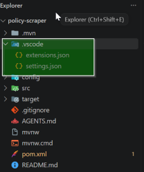
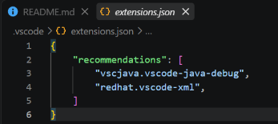
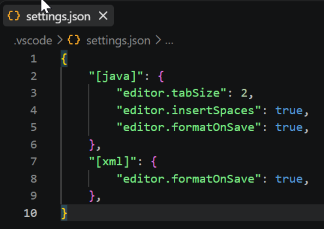
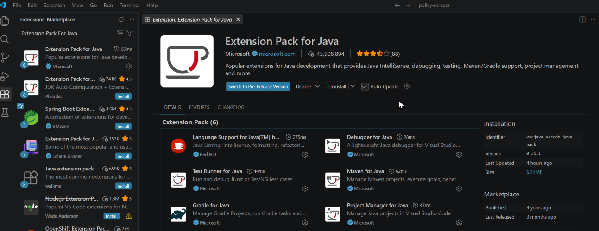
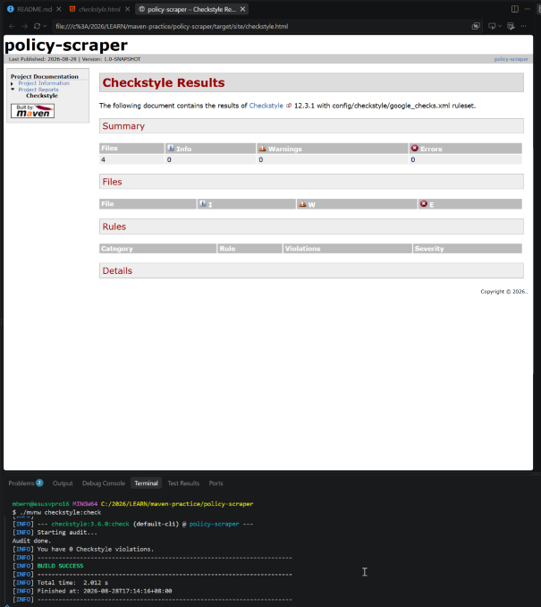
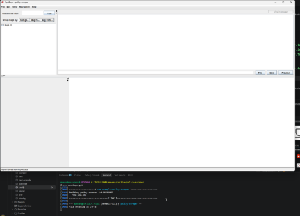

# TEST ONLY 

## Setup

First, clone the repository:

```bash
git clone https://github.com/mbernal-git/maven-practice-policy-scraper

cd maven-practice-policy-scraper
```

Once inside the project directory, run the Maven Wrapper to build and verify the project:

```bash
./mvnw verify
```

## Development Requirements

### Java 17

We use [Java 17](https://adoptium.net/en-GB/temurin/releases?version=17) because it is an LTS (Long-Term Support) release, allowing the project to target a wider range of machines that support Java 17.

### Visual Studio Code

We use [Visual Studio Code](https://code.visualstudio.com/download) to align with the development environment used in our unit labs and lectures, making it easier for our facilitator to assist with technical issues.

## VS Code Development Configuration



This repository includes project level configurations .vscode/settings.json and .vscode/extensions.json to provide a consistent development environment for our project.



The ***extensions.json*** file lists the recommended VS Code extensions, allowing our team to install the required extensions directly from VS Code.



The ***settings.json*** file configures 2-space indentation and format on save to maintain consistent formatting with the Google Java Style guidelines.


## Extensions

Here are the extensions that will be recommended for installation:

### Extension Pack for Java



The **Extension Pack for Java** provides the required Java development tools, including language support, debugging, test running, Maven and Gradle support, and Java project management. 

### Maven

We use ***Apache Maven 3.6.x*** as our build and project management tool. This version is compatible with **Java 17** and provides the features required to build, test, and manage our project.

### XML by RedHat

The **XML extension by Red Hat** provides XML support, including syntax highlighting, validation, auto-completion, and formatting for files such as `pom.xml` and our Checkstyle configuration.


## Maven Plugins

### Checkstyle Maven Plugin



The ***Checkstyle Maven Plugin*** enforces coding standards and conventions and reports violations during the Maven build. 
By entering the command ./mvnw site it will generate a /site directory containing the html files for reporting. THere is also the terminal console audit result by default.

### SpotBugs Maven Plugin



The ***SpotBugs Maven Plugin*** analyses the code to detect potential bugs and common programming errors. It has a GUI which makes it easier for us to find bugs.

> If you check our [`pom.xml`](./pom.xml) at lines 71 and 95, we added an `<execution>` configuration so that Checkstyle and SpotBugs run automatically as part of the Maven build. This allows coding standard violations and potential bugs to be detected before changes are pushed to the repository, helping maintain code quality and consistency across the project. 

> You can now check the project for coding standards, conventions, and potential bugs using:

```bash
./mvnw verify
```

## Google Java Style

We use the ***Google Java Style*** Checkstyle configuration [google_check.xml](https://github.com/checkstyle/checkstyle/blob/master/src/main/resources/google_checks.xml) because it provides a well-established and consistent set of Java coding standards that are easy for beginners to understand and follow.

Checkstyle provides several commonly used configurations, including:

* **Google Java Style** — A widely used and well-documented style guide with clear conventions, making it suitable for beginners and our project.
* **Sun Checks** — The original Checkstyle configuration based on Sun's Java coding conventions. It is useful for legacy projects but is less commonly used for modern Java development.
* **Sun Checks with Suppression** — A variation of the Sun Checks configuration that allows certain checks to be suppressed, providing more flexibility but introducing additional configuration.

We chose **Google Java Style** because it gives our team a clear and consistent baseline without requiring us to define our own coding standards from scratch.

## Maven Wrapper

We use the **Maven Wrapper** (`mvnw` / `mvnw.cmd`) so all team members use the same Maven version without needing to install Maven separately. This ensures the project builds consistently across different machines.

For example:

```bash
./mvnw verify
```

## Maven Archetype

This project was scaffolded using the **Maven Quickstart Archetype**, which provides the initial structure and configuration for a standard Java Maven project.

